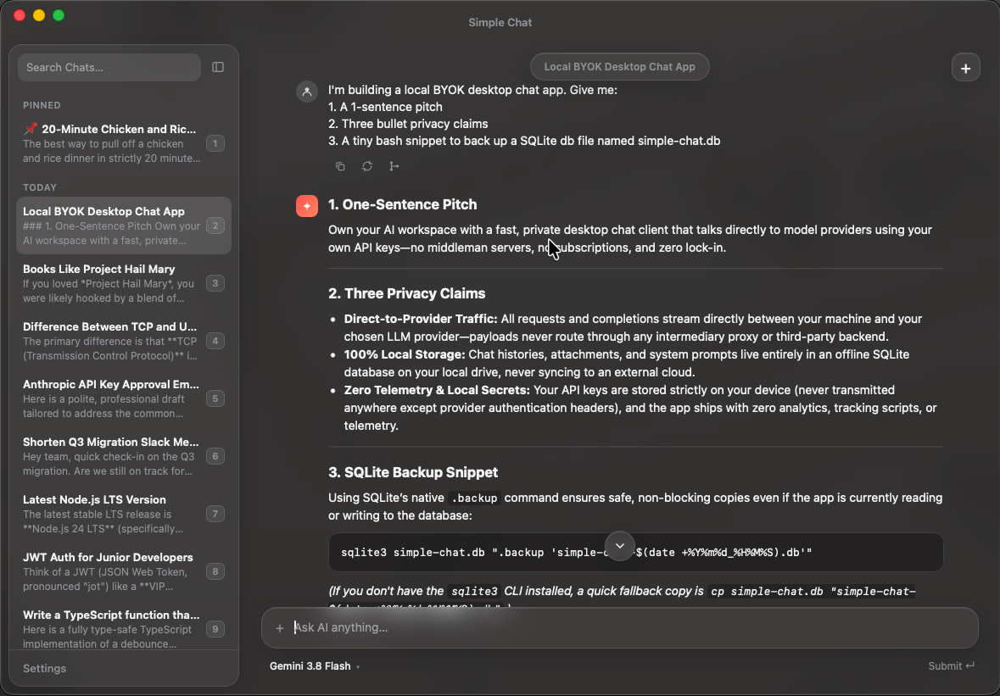

# Simple Chat

Minimal, open-source AI companion for your desktop. Summon it with a keystroke, ask a question, get back to work.

**100% local UI + history. Bring your own keys (BYOK).** No account, no subscription, no cloud for your chats.

Inspired by Raycast v2 charging for AI chat even with BYOK. Not everyone needs projects and advanced workspace features — sometimes you just want a hotkey chatbot on your own API key.



[Latest release](https://github.com/arpitdalal/simple-chat/releases/latest)

## Features

- **Hotkey summon** — recordable global shortcut (default `⌘/Ctrl+⇧+Space`); centers on the display under the cursor
- **BYOK** — OpenAI, Anthropic, Google; keys in the OS keychain / Credential Manager
- **Local history** — SQLite on your machine; empty “New Chat” rows auto-discarded
- **Resume** — reopen last chat within N minutes (default 5)
- **Images** — paste or attach for vision models
- **Web search** — provider-native tools, always on
- **Model picker** — filtered by which keys you’ve saved
- **Focus restore** — hiding returns focus to the previous app
- **Tray lifecycle** — close = hide; quit from tray; Esc closes settings, then hides

### Shortcuts

| Shortcut                                 | Action                           |
| ---------------------------------------- | -------------------------------- |
| Global hotkey (default `⌘/Ctrl+⇧+Space`) | Show / hide                      |
| `⌘/Ctrl+N`                               | New chat                         |
| `⌘/Ctrl+1` … `0`                         | Jump to chat in sidebar          |
| `⌘/Ctrl+,`                               | Settings                         |
| `⌘/Ctrl+B`                               | Toggle sidebar                   |
| `Esc`                                    | Close settings, then hide window |

## Privacy

- Chat history stays in a local SQLite database on your machine.
- API keys never leave the OS keychain except to call the provider you chose.
- There is no Simple Chat backend — prompts go to OpenAI / Anthropic / Google only, using _your_ key.
- Markdown in replies is sanitized against XSS.

## FAQ

### Why not Siri, MS Copilot, ChatGPT, Claude Code, etc — and why BYOK?

Not every piece of information can be sent everywhere. If your business requires strict privacy or your employer mandates using a specific, sanctioned API key—BYOK ensures your prompts go directly to that endpoint and nowhere else.

### Where is chat history stored?

On your machine in SQLite. On macOS:

`~/Library/Application Support/com.arpitdalal.simple-chat/simple-chat.db`

(plus `-wal` / `-shm` while the app is running). API keys are in the OS keychain, not the database.

### Do you see my prompts?

No. There is no Simple Chat server. Prompts go only to the provider whose key you saved (OpenAI, Anthropic, or Google).

### How do I quit?

Closing the window only hides the app. Quit from the menu bar / tray icon.

### Does it work offline?

The UI and history are local. Calling a model needs network access to that provider (and web search needs the network too).

### Which models / providers?

OpenAI, Anthropic, and Google — whichever keys you’ve saved. The picker shows a curated catalog for those providers; you can also enter a custom model id your key can use.

### Is this competing with Raycast?

No. Raycast is a full launcher with many features. Simple Chat is a small BYOK hotkey chatbot — inspired by wanting that without a subscription for AI chat.

## Local build

Want to build the app yourself instead of using a prebuilt installer:

1. Install [Node.js 24+](https://nodejs.org/), [Rust](https://www.rust-lang.org/tools/install), and the [Tauri prerequisites](https://v2.tauri.app/start/prerequisites/) for your OS.
2. Install the pinned pnpm version:

```bash
npm install --global pnpm@12.6.0
```

3. Clone and build:

```bash
git clone https://github.com/arpitdalal/simple-chat.git
cd simple-chat
pnpm install
pnpm tauri:build
```

The packaged app lands under `apps/desktop/src-tauri/target/release/bundle/` (e.g. `.app` / `.dmg` on macOS).

Unsigned local builds won’t auto-update from GitHub Releases. Signing/updater keys are only needed for official release artifacts.

## Contributing

Contributions are welcome — PRs, issues, ideas — but there’s no guarantee anything will be merged.

Same toolchain as local build: [Node.js 24+](https://nodejs.org/), [Rust](https://www.rust-lang.org/tools/install), and the [Tauri prerequisites](https://v2.tauri.app/start/prerequisites/) for your OS.

```bash
pnpm install
pnpm check
pnpm tauri:dev
```

`tauri:dev` may briefly show a Dock icon / wrong menu name. Release builds use `LSUIElement` + accessory policy (no Dock; menu name “Simple Chat”).

### Tests

```bash
pnpm test          # unit + component (vitest)
pnpm test:e2e      # browser UX (playwright + in-memory Tauri mocks)
pnpm test:ipc      # real Tauri↔Rust IPC via embedded WebDriver (macOS; needs release binary)
pnpm test:all
```

`test:ipc` expects `apps/desktop/src-tauri/target/release/simple-chat` (`pnpm build`, then in `apps/desktop/src-tauri`: `TAURI_CONFIG=… cargo build --release --features webdriver`). CI runs that path on macOS — Linux/Windows WebView automation sends an invalid IPC Origin.

### CI / Release

- **CI** (`.github/workflows/ci.yml`): on `main`/PR — vitest + `cargo test` (ubuntu), Playwright e2e (macOS), then `tauri-apps/tauri-action` builds for macOS arm64 + x64. Updater signing skipped on CI; ad-hoc signing (`APPLE_SIGNING_IDENTITY=-`). Win/Linux binary CI deferred.
- **Release** (`.github/workflows/release.yml`): on `v*` tags (or manual dispatch from `main`) — preflight → tests + macOS e2e → draft GitHub Release → signed/notarized macOS matrix upload. Publish the draft when ready. Needs `TAURI_SIGNING_PRIVATE_KEY` and Apple secrets (`APPLE_CERTIFICATE`, `APPLE_CERTIFICATE_PASSWORD`, `APPLE_API_KEY`, `APPLE_API_ISSUER`, `APPLE_API_KEY_CONTENT`). After a failed tag release, delete the `v*` tag before re-pushing. Ships `.app` (updater) + DMG.

Release builds that publish updater artifacts need `TAURI_SIGNING_PRIVATE_KEY` (key contents or file path). Pubkey lives in `apps/desktop/src-tauri/tauri.conf.json`. Updater endpoint: GitHub Releases `latest.json`.

## Stack

Tauri 2 · React · AI SDK · SQLite

## License

[MIT](LICENSE). Do whatever you want.
